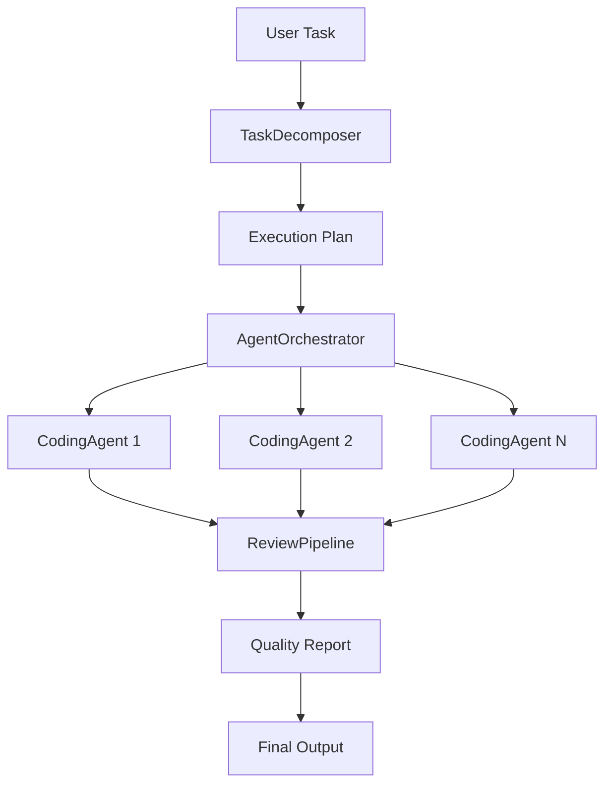

# 🔥 Morpheus

> Orchestrate autonomous coding agents at scale

[](https://github.com/MukundaKatta/morpheus/actions)
[](LICENSE)
[]()

## What is Morpheus?

Morpheus is a Python framework for orchestrating autonomous coding agents. It decomposes complex programming tasks into subtasks, assigns them to specialized agents, manages code generation and review pipelines, and coordinates multi-agent collaboration for software development at scale.

## ✨ Features

- ✅ Task decomposition — break complex coding tasks into subtasks
- ✅ Agent orchestration — manage multiple coding agents in parallel
- ✅ Code review pipeline — automatic quality checks on generated code
- ✅ Planning engine — create execution plans from natural language tasks
- ✅ CLI for running and monitoring coding agents
- 🔜 Git integration for automatic PR creation
- 🔜 Multi-language code generation support

## 🚀 Quick Start

```bash
pip install -e .
morpheus plan "Build a REST API for user management"
morpheus run "Add pagination to the user list endpoint"
morpheus status
```

## 🏗️ Architecture



## 📖 Inspired By

Inspired by [Devin](https://devin.ai) and [OpenHands](https://github.com/All-Hands-AI/OpenHands) but focused on orchestration patterns for multiple specialized agents.

---

**Built by [Officethree Technologies](https://github.com/MukundaKatta)** | Made with ❤️ and AI
